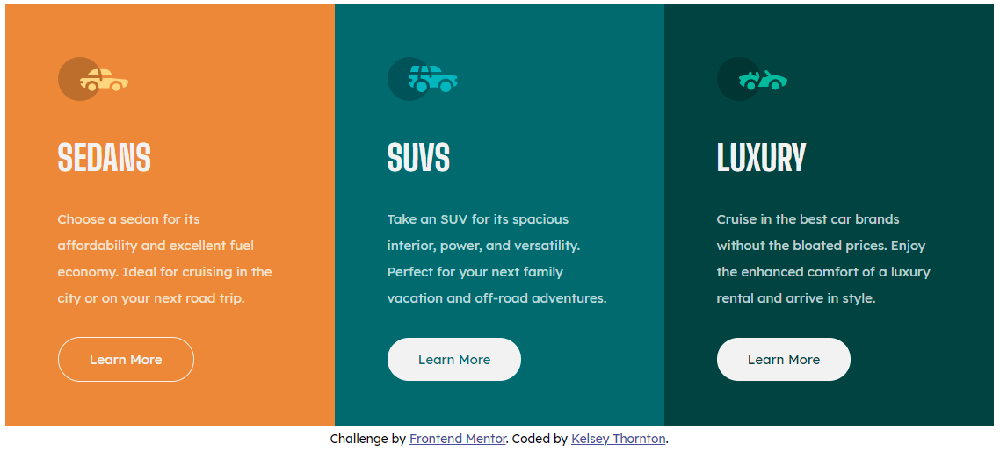

# Frontend Mentor - 3-column preview card component solution

This is a solution to the [3-column preview card component challenge on Frontend Mentor](https://www.frontendmentor.io/challenges/3column-preview-card-component-pH92eAR2-). Frontend Mentor challenges help you improve your coding skills by building realistic projects.

## Table of contents

- [Overview](#overview)
  - [The challenge](#the-challenge)
  - [Screenshots](#screenshots)
  - [Links](#links)
- [My process](#my-process)
  - [Built with](#built-with)
  - [What I learned](#what-i-learned)
  - [Continued development](#continued-development)
  - [Useful resources](#useful-resources)
- [Author](#author)
- [Acknowledgments](#acknowledgments)

## Overview

### The challenge

Users should be able to:

- View the optimal layout depending on their device's screen size
- See hover states for interactive elements

### Screenshots



Screenshot of the deskop layout. On the first card the (invisible) cursor is currently hovering over the "Learn More" button.


Screenshot of the mobile layout.


There is an issue with the initial layout if the text in the three "cards" is not of similar lengths.

### Links

- Solution URL: [Here](https://github.com/KelseyThornton/3-column-preview-card-component-main)
- Live Site URL: [Here](https://kelseythornton.github.io/3-column-preview-card-component-main/)

## My process

- Initially create the HTML file and look at the rendered document on a narrow window (simulate mobile view).
- Separate the content in to logical packets:
  - Each of the "cards" was defined as an `<article>`
  - The "cards" were grouped together in one `<section>` (later renamed to `<main>`)
- CSS was generated to render the "cards" as required.
- While changing the screen width, an issue was found where the "call to action" buttons did not line up nicely at the bottom of the "card", but simply after the text.
- This issue was resulved by using absolute positioning on the "cta" within the parent "card".
- A related issue where the text in the "card" was very short caused the respective card to be rendered too narrow, which resulted in gaps on either side of the content.
- This issue was resuolved byu setting the "card" to have a width of 100% of its parent.
- Better semantic names were assigned to the outer blocks: `<main>`, and `<footer>`.

### Built with

- Semantic HTML5 markup
- CSS custom properties
- Flexbox
- CSS Grid
- Mobile-first workflow
  <!-- - [React](https://reactjs.org/) - JS library -->
  <!-- - [Next.js](https://nextjs.org/) - React framework -->
  <!-- - [Styled Components](https://styled-components.com/) - For styles -->

<!-- **Note: These are just examples. Delete this note and replace the list above with your own choices** -->

### What I learned

Use this section to recap over some of your major learnings while working through this project. Writing these out and providing code samples of areas you want to highlight is a great way to reinforce your own knowledge.

To see how you can add code snippets, see below:

```html
<h1>Some HTML code I'm proud of</h1>
```

```css
.proud-of-this-css {
  color: papayawhip;
}
```

```js
const proudOfThisFunc = () => {
  console.log("🎉");
};
```

If you want more help with writing markdown, we'd recommend checking out [The Markdown Guide](https://www.markdownguide.org/) to learn more.

**Note: Delete this note and the content within this section and replace with your own learnings.**

### Continued development

Use this section to outline areas that you want to continue focusing on in future projects. These could be concepts you're still not completely comfortable with or techniques you found useful that you want to refine and perfect.

**Note: Delete this note and the content within this section and replace with your own plans for continued development.**

### Useful resources

- [Example resource 1](https://www.example.com) - This helped me for XYZ reason. I really liked this pattern and will use it going forward.
- [Example resource 2](https://www.example.com) - This is an amazing article which helped me finally understand XYZ. I'd recommend it to anyone still learning this concept.

**Note: Delete this note and replace the list above with resources that helped you during the challenge. These could come in handy for anyone viewing your solution or for yourself when you look back on this project in the future.**

## Author

- Website - [Add your name here](https://www.your-site.com)
- Frontend Mentor - [@yourusername](https://www.frontendmentor.io/profile/yourusername)
- Twitter - [@yourusername](https://www.twitter.com/yourusername)

**Note: Delete this note and add/remove/edit lines above based on what links you'd like to share.**

## Acknowledgments

This is where you can give a hat tip to anyone who helped you out on this project. Perhaps you worked in a team or got some inspiration from someone else's solution. This is the perfect place to give them some credit.

**Note: Delete this note and edit this section's content as necessary. If you completed this challenge by yourself, feel free to delete this section entirely.**
