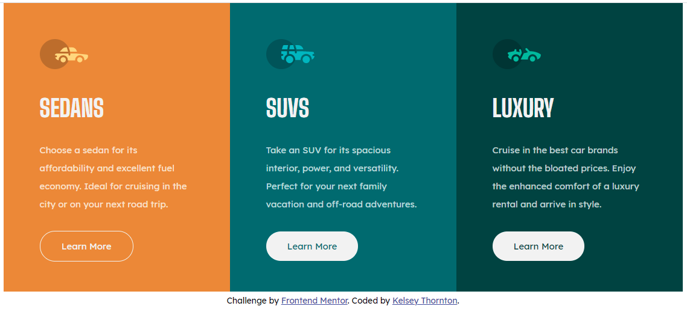
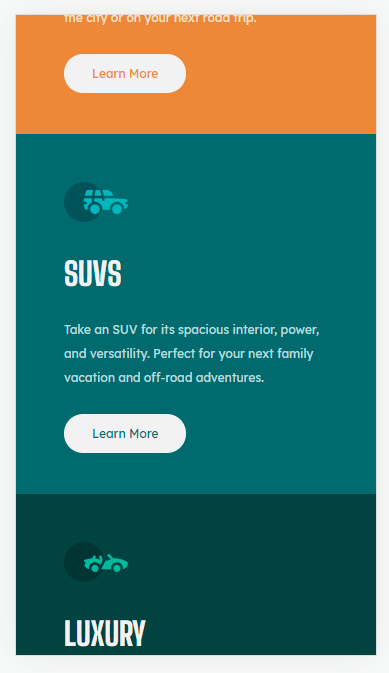
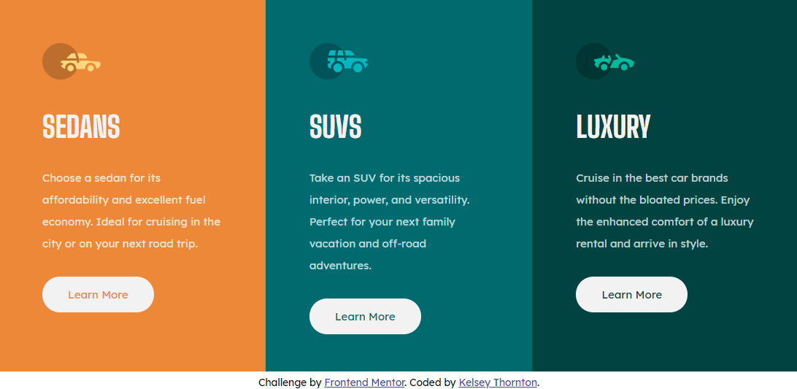

# Frontend Mentor - 3-column preview card component solution

This is a solution to the [3-column preview card component challenge on Frontend Mentor](https://www.frontendmentor.io/challenges/3column-preview-card-component-pH92eAR2-). Frontend Mentor challenges help you improve your coding skills by building realistic projects.

## Table of contents

- [Overview](#overview)
  - [The challenge](#the-challenge)
  - [Screenshots](#screenshots)
  - [Links](#links)
- [My process](#my-process)
  - [Built with](#built-with)
  - [What I learned](#what-i-learned)
- [Author](#author)

## Overview

I deliberately chose a simple project for my first attempt despite already knowing quite a lot about HTML and CSS. This was because most of my knowledge in these areas is now somewhat outdated - both HTML and CSS have come a long way!

### The challenge

Users should be able to:

- View the optimal layout depending on their device's screen size
- See hover states for interactive elements

### Screenshots

Screenshot of the deskop layout. On the first card the (invisible) cursor is currently hovering over the "Learn More" button.

Screenshot of the mobile layout.

There is an issue with the initial layout if the text in the three "cards" is not of similar lengths.

### Links

- Solution URL: [Here](https://github.com/KelseyThornton/3-column-preview-card-component-main)
- Live Site URL: [Here](https://kelseythornton.github.io/3-column-preview-card-component-main/)

## My process

- Initially create the HTML file and look at the rendered document on a narrow window (simulate mobile view).
- Separate the content in to logical packets:
  - Each of the "cards" was defined as an `<article>`
  - The "cards" were grouped together in one `<section>` (later renamed to `<main>`)
- CSS was generated to render the "cards" as required.
- While changing the screen width, an issue was found where the "call to action" buttons did not line up nicely at the bottom of the "card", but simply after the text.
- This issue was resulved by using absolute positioning on the "cta" within the parent "card".
- A related issue where the text in the "card" was very short caused the respective card to be rendered too narrow, which resulted in gaps on either side of the content.
- This issue was resuolved byu setting the "card" to have a width of 100% of its parent.
- Better semantic names were assigned to the outer blocks: `<main>`, and `<footer>`.

### Built with

- Semantic HTML5 markup
- CSS custom properties
- Flexbox
- CSS Grid
- Mobile-first workflow
  <!-- - [React](https://reactjs.org/) - JS library -->
  <!-- - [Next.js](https://nextjs.org/) - React framework -->
  <!-- - [Styled Components](https://styled-components.com/) - For styles -->

### What I learned

items in a CSS grid aren't automatically as wide as the parent element!

## Author

- Website - [Kelsey Thornton](https://www.your-site.com)
- Frontend Mentor - [@KelseyThornton](https://www.frontendmentor.io/profile/KelseyThornton)
